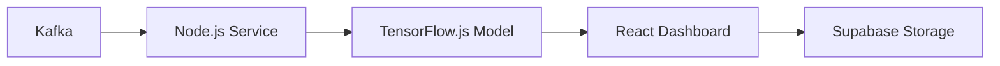

# GSoC Contribution Guide – **AI‑Powered‑Security‑Monitoring‑Threat‑Detection‑Platform**

> **Purpose** – This document provides a *deep‑dive* workflow for students, mentors, and maintainers who want to contribute to this repository as part of **Google Summer of Code 2026**. It extends the generic `CONTRIBUTING.md` with GSoC‑specific expectations, tooling, and deliverables.

---

## 1️⃣ Prerequisites & Environment

| Item | Recommended Version | Why it matters |
|------|--------------------|----------------|
| **Node.js** | `>=20.0.0` (LTS) | Modern ES‑modules, better performance |
| **npm / yarn** | `>=9.0.0` | Deterministic lockfiles |
| **Docker** | `>=24.0` | Guarantees reproducible builds across OSes |
| **Git** | `>=2.40` | Required for signed commits & PR workflow |
| **Python** | `3.11` (optional) | Used by some CI scripts for linting |
| **VS Code** | Latest + extensions: ESLint, Prettier, GitLens | Consistent developer experience |
| **Windows PowerShell** | Run Docker commands in PowerShell or Git Bash; ensure execution policy allows scripts (`Set-ExecutionPolicy -Scope Process -ExecutionPolicy Bypass`). | Improves Windows dev experience |


### 1.1 Local Development (Docker‑first)
```bash
# Clone the repo (fork first)
git clone https://github.com/<your‑username>/AI-Powered-Security-Monitoring-Threat-Detection-Platform.git
cd AI-Powered-Security-Monitoring-Threat-Detection-Platform

# Build the dev container (Dockerfile is in the repo root)
docker build -t ai‑security‑dev .
# Run the container with hot‑reload
docker run -it --rm -p 3000:3000 -v "$(pwd):/app" ai‑security‑dev
```
The app will be reachable at `http://localhost:3000`. All linting, type‑checking, and tests run inside the container, ensuring a uniform environment.

---

## 2️⃣ Selecting a GSoC Project Idea

1. **Browse the official GSoC ideas** – located in `ideas/` or on the organization’s GSoC page.
2. **Map your skill set** – e.g.,
   - *Machine Learning*: anomaly detection, model compression.
   - *Frontend*: glass‑morphism UI, real‑time visual analytics.
   - *DevOps*: GitHub Actions, Docker‑Compose orchestration.
3. **Validate scope** – ensure the idea can be delivered within the 12‑week GSoC window (≈ 300 hrs).
4. **Create a proposal issue** – title it `GSoC: <Your Idea Title>` and add the **GSoC‑Proposal‑Template** (see Section 4).

> **If you cannot find a suitable idea**, feel free to propose a *new* one following the same template; maintainers will review and label it appropriately.

---

## 3️⃣ Mentor Engagement & Communication Plan

| Communication Channel | Frequency | Content |
|-----------------------|-----------|---------|
| **Weekly Sync (Zoom/Meet)** | Every Friday 10 AM IST | Progress demo, blockers, next‑step plan |
| **Slack / Discord** | Daily (as needed) | Quick questions, code snippets |
| **GitHub Issues/PRs** | Continuous | Formal record of decisions, review comments |
| **Monthly Report (Google Docs)** | End of month | Summary of achievements, metrics, risk assessment |

**Best Practices**
- Keep a *shared* Google Sheet with milestones, owners, and status.
- Tag mentors in PRs using `@mentor‑handle`.
- Record all demo sessions and upload to the shared drive for future reference.

---

## 4️⃣ GSoC Proposal Template (Markdown)
```markdown
# Project Title

## 1️⃣ Motivation & Impact
*Why does this feature matter for a security‑monitoring platform?* Include statistics, threat models, or user‑story examples.

## 2️⃣ Goals & Deliverables
| Milestone | Description | Acceptance Criteria |
|----------|-------------|---------------------|
| **M1** | Data‑ingestion pipeline (Kafka → Node.js) | Unit tests ≥ 90 % coverage, end‑to‑end demo |
| **M2** | Real‑time anomaly detection model (TensorFlow.js) | Latency < 200 ms per event |
| **M3** | UI visualisation (glass‑morphism dashboard) | Responsive, dark‑mode, accessibility WCAG AA |
| **M4** | CI/CD automation (GitHub Actions) | Automated lint, test, build, and Docker image publish |

## 3️⃣ Technical Approach
- **Architecture Diagram** (Mermaid):

- **Key Libraries**: `kafkajs`, `@tensorflow/tfjs`, `react‑router`, `styled‑components`.
- **Data Flow**: Explain how events are consumed, processed, and visualised.

## 4️⃣ Timeline (Gantt‑style)
| Week | Activity |
|------|----------|
| 1‑2 | Environment setup, baseline tests |
| 3‑4 | Implement data‑ingestion service |
| 5‑6 | Build and train anomaly model |
| 7‑8 | UI dashboard prototype |
| 9‑10| CI/CD pipelines & Docker images |
| 11‑12| Documentation, final demo, hand‑over |

## 5️⃣ Risks & Mitigations
- **Model latency** – Profile with Chrome DevTools; fallback to a lightweight heuristic.
- **Data privacy** – Encrypt data at rest using Supabase policies.
- **Scope creep** – Keep milestones atomic; defer optional features to post‑GSoC.

## 6️⃣ Testing & Verification
- **Unit Tests** – `jest` + `ts-jest` for all TypeScript modules.
- **Integration Tests** – `supertest` for API endpoints.
- **E2E Tests** – `cypress` covering UI flows (login → dashboard).
- **Performance Benchmarks** – Use `autocannon` for API load testing.

---
```
Save this template as `gsoc_proposal_<your‑name>.md` and reference it in the issue description.

---

## 5️⃣ Development Workflow (Advanced)
1. **Fork → Clone** the repo (use the Docker dev container).
2. **Create a feature branch** per milestone, e.g., `gsoc-m1-data-ingestion`.
3. **Commit style** – Follow Conventional Commits (`feat:`, `fix:`, `perf:`). Enable `commitlint` in the CI.
4. **Run the full test suite** before pushing:
   ```bash
   npm run lint && npm run test:coverage && npm run build
   ```
5. **Open a Pull Request** targeting `main`.
   - **PR Title**: `gsoc-m1: Data ingestion pipeline`
   - **PR Description**: Include the milestone number, a short summary, and a link to the related issue.
   - **Checklist** (copy‑paste):
     ```markdown
     - [ ] Follows `CONTRIBUTING.md` & `CODE_OF_CONANDARD.md`
     - [ ] Unit & integration tests added (≥ 90 % coverage)
     - [ ] Documentation updated (`docs/` or README)
     - [ ] CI passes (GitHub Actions)
     - [ ] Demo video attached (optional but encouraged)
     ```
6. **CI/CD** – The repository ships a GitHub Actions workflow ([`.github/workflows/ci.yml`](.github/workflows/ci.yml)) that runs lint, tests, builds Docker image, and pushes the image to GitHub Packages on merge.
7. **Release Process** – After the final milestone, a maintainers‑only workflow tags a release (`vX.Y‑gsoc‑<name>`) and publishes the Docker image.

---

## 6️⃣ Advanced Testing Strategy
- **Static Analysis** – `eslint`, `prettier`, `typescript` strict mode (`noImplicitAny`).
- **Security Scanning** – `npm audit`, `snyk` integrated in CI.
- **Performance Profiling** – Use `clinic.js` for Node services and Chrome DevTools for the React UI.
- **Accessibility** – Run `axe-core` in CI; aim for WCAG AA compliance.
- **Cross‑Browser Testing** – Cypress runs on Chrome, Firefox, and Edge via the `cypress-browser` plugin.

---

## 7️⃣ Documentation & Knowledge Transfer
- **Typedoc** – Generate API docs (`npm run docs`) and host them on GitHub Pages.
- **Architecture Docs** – Keep `docs/architecture.md` up‑to‑date with Mermaid diagrams.
- **On‑boarding Guide** – Add a `docs/onboarding.md` for future contributors.
- **Post‑GSoC Handover** – Create a `gsoc‑handover.md` summarising:
  - What was built, where the code lives.
  - Open issues & future work.
  - Metrics (performance, coverage).

---

## 8️⃣ Final Deliverables Checklist
- [ ] All milestone PRs merged and CI green.
- [ ] Release tag `vX.Y‑gsoc‑<your‑name>` created.
- [ ] Demo video (2‑3 min) uploaded to the shared drive.
- [ ] `gsoc‑handover.md` committed to `docs/`.
- [ ] Final GSoC report submitted on the portal with links to PRs, demo, and handover.

---

## 🎉 Ready to Start?
Follow the steps above, keep communication transparent, and you’ll have a *premium*, production‑ready contribution that stands out in the GSoC community. Good luck, and happy coding! 🚀

---

*All contributions are made under the project's **MIT License**.*
