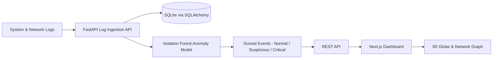

# 🛡️ AI-Powered Security Monitoring & Threat Detection Platform


A comprehensive, **GSOC-level security monitoring solution** that leverages Artificial Intelligence to detect network anomalies, visualize threats in real-time, and provide actionable insights for system administrators.

---

## 📖 Overview

This platform is designed to bridge the gap between traditional log monitoring and modern AI-driven threat intelligence. By ingesting system and network logs in real-time, parsing them through an advanced **Isolation Forest** machine learning model, and visualizing the results on a dynamic **Next.js Dashboard**, it empowers security teams to identify zero-day attacks and subtle anomalies that rule-based systems miss.

## 🧩 Architecture Diagram



The platform ingests raw system and network logs, stores them in a relational database, scores them with an Isolation Forest model, and serves the results to a Next.js dashboard that renders traditional charts and immersive 3D visualizations.

## 🚀 Key Features

*   **🕵️ Real-time Anomaly Detection**: Utilizes Unsupervised Learning (Isolation Forest) to detect outliers in network traffic and user behavior.
*   **📊 Interactive Dashboard**: Built with **Next.js** and **Recharts** to visualize traffic spikes, threat distribution, and live logs.
* **🌐 3D Threat Globe Visualization**: Interactive 3D globe using React Three Fiber to visualize global threat distribution with color-coded severity indicators.
* **🔗 3D Network Topology Graph**: Real-time 3D network relationship mapping with interactive nodes showing server, client, and threat connections.
* **✨ Advanced 3D Animations**: Smooth animations, hover effects, and auto-rotation for immersive threat monitoring experience.
*   **⚡ High-Performance Backend**: **FastAPI** drives the API, ensuring millisecond-latency responses for log ingestion and inference.
*   **📥 Universal Log Ingestion**: capable of parsing standardized system logs and network traffic data.
*   **🚨 Threat Intelligence**: Automatically classifies events as "Normal", "Suspicious", or "Critical" based on AI confidence scores.

---

## 🛠️ Tech Stack

### Backend & AI
*   **Python 3.10+**: Core logic.
*   **FastAPI**: High-performance Async API framework.
*   **Scikit-learn**: Machine Learning (Isolation Forest).
*   **Pandas & NumPy**: Data manipulation and feature extraction.
*   **SQLAlchemy & SQLite**: ORM and Database (Easily scalable to PostgreSQL).

*   ### 🤖 Why Isolation Forest?

This project focuses on unsupervised anomaly detection, where labeled attack data is rare and patterns evolve quickly. Isolation Forest is well-suited because:

- It works **without labeled data**, matching real-world security logs where we don't have ground-truth labels for every event.
- It handles **high-dimensional, noisy features** (IPs, ports, sizes, timings) with robust performance.
- Compared to density-based methods (like LOF), it **scales better** to large log volumes and is faster to train and infer with.
- Compared to supervised classifiers, it doesn't overfit to known attack signatures and can surface **previously unseen, zero-day style anomalies**.

These properties make Isolation Forest a practical baseline model for an AI-powered security monitoring platform, while leaving room for future extensions (autoencoders, ensembles, or hybrid rules-plus-ML systems).

### Frontend
*   **Next.js 14**: React framework for production.
*   **TailwindCSS**: Utility-first styling.
*   **Recharts**: Composable charting library.
*   **Lucide React**: Beautiful icons.
* **Three.js**: WebGL 3D graphics library for immersive visualizations.
* **React Three Fiber**: React renderer for Three.js enabling declarative 3D scenes.
* **@react-three/drei**: Useful helpers and abstractions for React Three Fiber.

---

## ⚡ Getting Started

Follow these steps to set up the project locally.

### Prerequisites
*   Python 3.9 or higher
*   Node.js 18.0 or higher
*   Git

### 1. Clone the Repository
```bash
git clone https://github.com/yourusername/ai-security-monitor.git
cd ai-security-monitor
```

### 2. Backend Setup
Initialize the Python environment and install dependencies.

```bash
cd backend
# Create virtual environment (optional but recommended)
python -m venv venv
# Windows: venv\Scripts\activate
# Mac/Linux: source venv/bin/activate

# Install dependencies
pip install -r requirements.txt
```

### 3. Initialize AI Model
Train the initial model using the provided simulation data.

```bash
# From the root directory
python ai-model/train_model.py
```
*This will generate a `generated_logs.csv` dataset and save the trained model to `ai-model/isolation_forest_model.pkl`.*

### 4. Start the Backend Server
```bash
# From the root directory
uvicorn backend.main:app --reload --port 8000
```
The API will be available at `http://localhost:8000`.  
interactive Docs: `http://localhost:8000/docs`.

### 5. Frontend Setup
Open a new terminal and set up the Next.js dashboard.

```bash
cd frontend
npm install
npm run dev
```
The dashboard will launch at `http://localhost:3000`.

---

## 📊 API Documentation

| Method | Endpoint | Description |
| :--- | :--- | :--- |
| `GET` | `/` | Health check. |
| `POST` | `/logs/` | Ingest a new log entry. |
| `GET` | `/logs/` | Retrieve recent logs (supports pagination). |
| `POST` | `/predict/` | Get capability score for a specific traffic pattern. |

---

## 🔮 Roadmap

- [x] Core Log Ingestion & Database
- [x] Basic Anomaly Detection Model
- [x] Real-time Dashboard
- [ ] WebSocket Integration for Live Alerts
- [ ] User Authentication (OAuth2)
- [ ] Docker Containerization
- [ ] Deployment to Cloud (AWS/Render)

## 🤝 Contributing

Contributions are welcome! Please fork the repository and submit a pull request for any enhancements.

1.  Fork the Project
2.  Create your Feature Branch (`git checkout -b feature/AmazingFeature`)
3.  Commit your Changes (`git commit -m 'Add some AmazingFeature'`)
4.  Push to the Branch (`git push origin feature/AmazingFeature`)
5.  Open a Pull Request

## 📄 License

Distributed under the MIT License. See `LICENSE` for more information.
